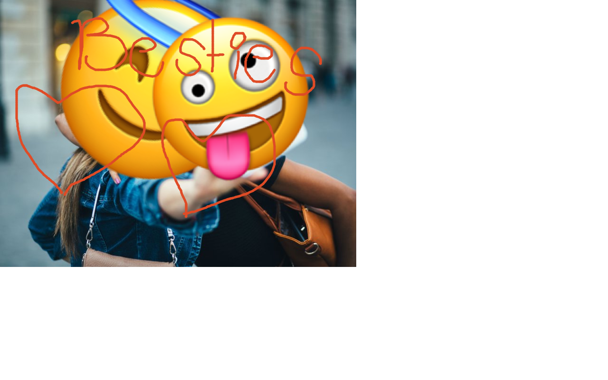

# emoji-editor
Allows you to draw to, caption and add emojis to your photos from the browser. This project utilizes plain javascript, jQuery, and some es6 typescript. 

The app can be found <a href="http://34.73.130.192:17000/">here.</a>
